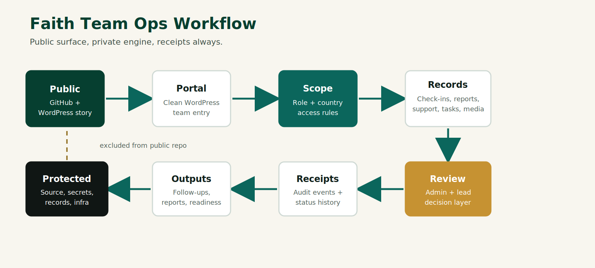
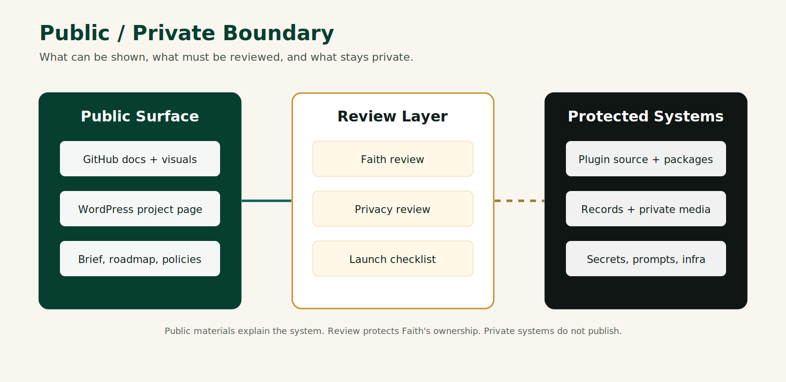

# Faith Team Ops


Faith Team Ops is a private WordPress-based operations platform for volunteers, contractors, organizers, moderators, country leads, admins, and remote teams across Faith's projects.

This repository is a protected public project surface. It is not the full source code, operational system, private workflow, or data room.

## What This Is

Faith Team Ops is the public-facing project profile for a private operations system. The platform is designed to help distributed teams check in, report blockers, request support, review assignments, preserve audit receipts, and keep sensitive team operations out of public channels.

The public repository exists to show the purpose, ownership, visual direction, workflow model, and implementation boundary without releasing private code, protected workflows, credentials, customer data, internal prompts, or deployment infrastructure.

## Why It Matters

Distributed work breaks when the only operating memory lives in chat threads, scattered documents, and people's heads. Faith Team Ops turns daily coordination into a structured, auditable system of record while keeping the human layer clear: country scope, role access, support requests, weekly reports, private voice notes, and action receipts.

## Who It Is For

- Owners and admins who need a private operating room for multi-project teams.
- Country leads and organizers who need scoped dashboards without WordPress admin clutter.
- Volunteers and contractors who need fast mobile check-ins, assigned work, and support paths.
- Moderators and reviewers who need careful visibility without unnecessary access.

## How It Works



At a public level, the workflow is simple:

1. Team members enter through a clean WordPress portal.
2. Role and country scope determine what they can see and submit.
3. Check-ins, reports, support requests, tasks, and private media become operational records.
4. Admin review and audit layers preserve receipts.
5. Public GitHub and WordPress pages explain the product without exposing the private engine.

## Visual Implementation Directions

The current public visual board contains three implementation directions. All three are preserved here so GitHub readers and WordPress visitors can understand the range of the tool before a final portal UI direction is selected.


| Direction | Best Fit | WordPress Implementation Use |
| --- | --- | --- |
| Signal Desk | Daily operations, check-ins, tasks, support requests, and fast scan speed | Safest day-one portal style: white cards, deep green navigation, compact modules, clear mobile actions |
| Field Command | Country leads, field coordination, global scope, and active distributed teams | More expressive command-center style: teal surfaces, country scope, high-contrast audit and event rails |
| Care Ledger | Support, moderation, pastoral/team care, accountability, and dignity | Trust-forward ledger style: black, gold, and green navigation, warm support language, calm audit rows |

## Public Surface

This repository may include:

- Project brief and public status.
- Public/private boundary documentation.
- Ownership and commercial-use policy.
- Workflow diagrams.
- Visual concept assets.
- WordPress page draft and metadata.
- Privacy review and launch checklist.

## Protected Materials

The following remain private:

- WordPress plugin source and release packages.
- Credentials, secrets, tokens, keys, and environment files.
- Deployment scripts and operational infrastructure.
- Internal prompts, agent instructions, and private automation workflows.
- Private records, support data, voice-note storage, team data, legal/admin records, and unpublished strategy.



## Current Status

- Public export package prepared: 2026-06-19.
- Chosen public repository slug: `faith-team-ops`.
- GitHub URL: `https://github.com/thefayth/faith-team-ops`.
- Local private implementation status: WordPress plugin candidate `0.2.9`.
- Launch status: public project surface ready after Faith review; private production launch is not claimed here.
- GitHub publication status: repository created and populated from `_github_public_export/` after clearing stale process proxy variables.

## Learn More

The public WordPress page draft is prepared for:

```text
/projects/faith-team-ops/
```

See:

- [Project Brief](docs/PROJECT_BRIEF.md)
- [Status](docs/STATUS.md)
- [Public / Private Boundary](docs/PUBLIC_PRIVATE_BOUNDARY.md)
- [Workflow Diagrams](docs/WORKFLOW_DIAGRAMS.md)
- [WordPress Page Draft](docs/WORDPRESS_PAGE_DRAFT.md)
- [Commercial Use Policy](docs/COMMERCIAL_USE_POLICY.md)

All rights reserved. No source release is granted or implied.
