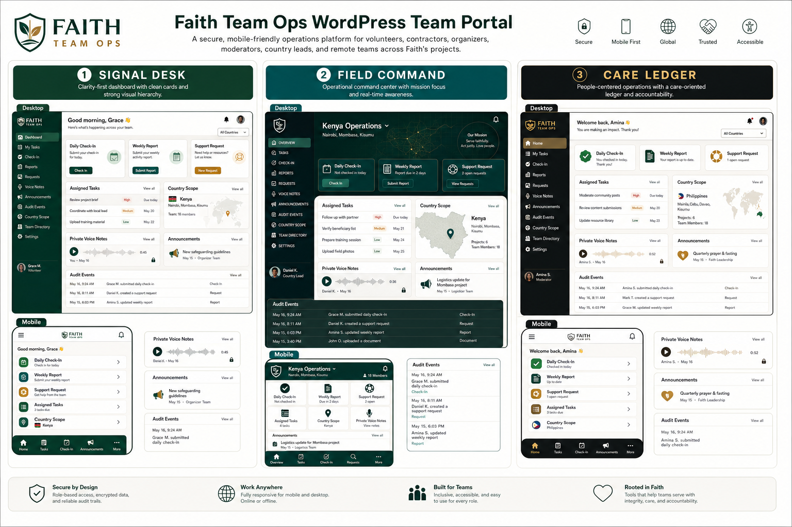

# Faith Team Ops

Public surface. Private engine. Receipts always.



Faith Team Ops is a private WordPress-based operations platform for volunteers, contractors, organizers, moderators, country leads, admins, and remote teams across Faith's projects.

This public page explains the project without exposing the private source code, operational system, private workflow, credentials, or data room.

## What This Project Is

Faith Team Ops is a private operating room for distributed work. It helps teams check in, report blockers, request support, review assignments, preserve audit receipts, and keep sensitive work out of public channels.

The platform is WordPress-based because WordPress can serve as a practical system of record while still allowing a clean, mobile-friendly portal experience for daily users.

## Why It Matters

Serious distributed work needs more than scattered chats and memory. Team Ops gives the work structure:

- role-aware access
- country and team scope
- daily check-ins
- weekly reports
- support requests
- task status
- private media paths
- audit receipts

The goal is not more bureaucracy. The goal is clearer care, cleaner handoffs, better accountability, and less operational forgetting.

## How It Works


Team members enter through a WordPress portal. Their role and scope determine what they can see and submit. Country leads and admins review the work. Important actions leave receipts. Public materials explain the concept, while private source, private records, credentials, and infrastructure remain protected.

## Project Highlights

- Private WordPress operations platform.
- Mobile-first portal direction.
- Role and country-scoped workflows.
- Check-ins, reports, support requests, tasks, and private media metadata.
- Audit-first operating model.
- Public GitHub surface with private implementation boundary.

## Current Status

Faith Team Ops has a public repository package prepared for GitHub and a WordPress page draft prepared for review. The private implementation remains separate, and this page does not claim a full production launch.

GitHub repository target:

```text
https://github.com/thefayth/faith-team-ops
```

## Visual Gallery


The current visual board shows three ways the tool can be implemented:

### Signal Desk

The safest day-one operations dashboard. Signal Desk emphasizes clean cards, deep green navigation, fast scan speed, daily check-ins, support requests, tasks, and private voice-note access.

### Field Command

The country-ops command center. Field Command emphasizes global coordination, country scope, teal command surfaces, dense but organized dashboards, and high-contrast audit/event awareness.

### Care Ledger

The people-centered ledger. Care Ledger emphasizes trust, dignity, support, accountability, warm language, ledger-style rows, and care-forward icons.

## Public Materials

The public GitHub package may include:

- project brief
- status and roadmap
- ownership and commercial-use policy
- workflow diagrams
- visual concept assets
- WordPress page draft
- privacy review
- launch checklist

## Protected Materials

The public package does not include:

- plugin source code
- credentials or secrets
- deployment systems
- private automation workflows
- private records or media
- internal prompts or agent instructions
- legal/admin, medical, benefits, family, or unpublished strategy files


## Relationship To Faith's Ecosystem

Faith Team Ops supports Faith's wider ecosystem by giving distributed work a private, auditable operating layer. Public-facing pages can explain what the platform is and why it matters, while the actual engine remains protected.

## Ownership Statement

Faith Team Ops is owned by Faith Cheltenham. All rights are reserved. No source release, redistribution permission, model-training permission, or commercial use permission is granted by the public repository or this page.

## Learn More

The GitHub public project surface is prepared for:

```text
https://github.com/thefayth/faith-team-ops
```

Publishing should happen only after Faith reviews the page, visual framing, ownership language, and public/private boundary.
